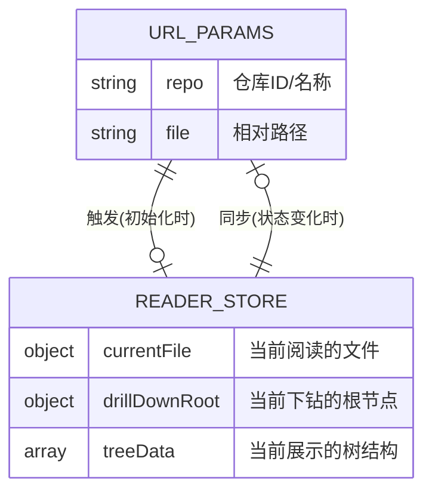

# 产品需求文档 (PRD)

## 1. 文档概述 (Document Overview)

### 1.1 文档信息
* **需求名称**：分享文档链接 (Share Document Link)
* **所属迭代**：2604_2
* **文档状态**：起草中
* **目标读者**：前端开发、后端开发、测试工程师

### 1.2 修订历史
| 版本 | 日期 | 修改内容 | 作者 |
| :--- | :--- | :--- | :--- |
| V1.0 | 2026-04-16 | 初始版本，完成分享交互与深度链接逻辑定义。 | PM |

## 2. 需求背景与目标 (Background & Objectives)

### 2.1 当前痛点
目前系统只能分享根域名。团队成员（如 PM）在沟通时需要精确指向某个特定文档，接收方必须自己在庞大的左侧文件树中逐层寻找，沟通成本极高且容易找错文档版本。

### 2.2 业务目标
实现深度链接（Deep Linking）与便捷分享机制。
1. 使系统的 URL 能够实时反映当前阅读的仓库和文件路径。
2. 提供显式的分享入口，一键复制。
3. 接收者点击链接后“开箱即用”，系统自动定位、展开树节点并渲染目标内容。

## 3. 名词字典 (Glossary)

| 名词 (Term) | 定义说明 (Definition) | 备注 (Notes) |
| :--- | :--- | :--- |
| **系统分享链接** | 包含当前系统域名、路由及特定查询参数（`repo` 和 `file`）的 URL。用于系统内部成员间的精准跳转。 | 示例：`http://host/?repo=PRD-Reader&file=docs/readme.md` |
| **下钻模式 (Drill-down)** | 一种特殊的左侧文件树渲染状态。不显示完整的仓库列表，而是以分享链接指定的文件夹（或文件所在的父文件夹）作为唯一根节点进行渲染。 | 提升特定文档阅读时的专注度，减少无关目录干扰。 |
| **原位拦截 (In-place Interception)** | 当分享链接失效或无权限时，不触发全局路由跳转（不跳走），而是在现有的主阅读区组件内部直接渲染 404 状态页。 | 保证侧边栏及系统框架的稳定。 |

## 4. 核心业务流程 (Business Flow)
请参考配套的业务流程图：[Business_Flow.md](./Flow/Business_Flow.md)。
核心分为分享者和接收者两条链路：
1. **分享者**：悬停树节点 -> 点击分享 Icon -> 弹出选项菜单 -> 选择复制系统链接 -> 剪贴板写入并 Toast 提示。
2. **接收者**：点击链接 -> 系统解析参数 -> 校验权限与存在性 -> (若异常则原位渲染 404) -> (若正常则)触发左侧树下钻并高亮 -> 右侧拉取并渲染文件内容。

## 5. 数据流与状态流转 (Data & State Flow)

### 5.1 实体关系说明 (ER Diagram)
本次迭代不涉及新增后端实体，主要是前端状态机与 URL 的映射。

### 5.2 状态机约束
1. **单向同步优先**：用户点击左侧树节点导致 `currentFile` 变化时，`readerStore` 必须**静默更新**浏览器的 Query Params，不应触发页面完全刷新。
2. **初始化拦截**：系统仅在首次加载（Mount）时读取一次 URL 参数并派发动作。后续的浏览行为由状态机主导。

## 6. 功能模块与页面细节 (Features & UI Details)

### 6.1 全局：URL 状态同步器
- **区域介绍与规则**：运行在系统后台的隐形逻辑，负责维持 URL 地址栏与当前阅读状态的一致性。
- **展示元素定义**：无可见 UI。
- **逻辑规则**：
  1. 任何合法的树节点点击行为，必须实时更新 URL 的 `?repo=` 和 `file=` 参数。
  2. 若点击的是仓库根节点，URL 中仅保留 `repo` 参数，清除 `file` 参数。

### 6.2 左侧树：悬浮操作区与气泡菜单 (Popover)
- **区域介绍与规则**：挂载在左侧 `TreeNode` 组件上的交互元素。用于替代原有的“直接复制 Git 地址”行为。
- **展示元素定义**：

| 元素名称 | 逻辑 (数据来源/计算逻辑) | 限制与格式 |
| :--- | :--- | :--- |
| 分享 Icon | `Hover` 状态触发显示。 | 图标样式保持不变（`lucide-copy`）。 |
| 气泡菜单 (Popover) | 点击分享 Icon 触发。包含两个选项列表。 | 必须带有关闭遮罩（点击其他区域自动关闭）。 |
| 选项：复制 Git 地址 | `拼接该节点的远程仓库 URL` | 仅针对支持的平台（如 GitHub/GitLab）节点显示。 |
| 选项：复制系统链接 | `拼接当前域名 + ?repo=xx&file=yy` | 必显项。 |

- **异常与兜底**：
  - 若浏览器不支持 Clipboard API 或处于非 HTTPS 环境下导致复制失败，需弹出 Error Toast 提示用户“复制失败，请手动复制”。

### 6.3 左侧树：下钻模式 (Drill-down View)
- **区域介绍与规则**：接收者通过链接进入系统时，左侧树的特殊渲染形态。
- **展示元素定义**：

| 元素名称 | 逻辑 (数据来源/计算逻辑) | 限制与格式 |
| :--- | :--- | :--- |
| 顶部返回区 | `仅在下钻模式下显示` | 包含“返回上级”按钮和当前下钻路径文本。 |
| 下钻树结构 | `根据 URL file 参数计算父节点` | 隐藏全局仓库列表，仅展示目标文件夹及其子层级。 |

- **逻辑规则**：
  - 分享目标为**文件夹**：树的顶层直接显示该文件夹名称。
  - 分享目标为**文件**：树的顶层显示该文件所在的**父文件夹**名称。
  - 点击“返回上级”，清除下钻状态，恢复渲染全局仓库列表。

### 6.4 主阅读区：404 缺省状态页
- **区域介绍与规则**：用于原位拦截并展示因分享链接失效导致的错误信息。
- **展示元素定义**：

| 元素名称 | 逻辑 (数据来源/计算逻辑) | 限制与格式 |
| :--- | :--- | :--- |
| 状态 1：无权限 | `URL 中的 repo 不在白名单 或 接口返回 403` | 粉色底框 + 锁头 Icon。 |
| 状态 2：不存在 | `在内存树中找不到 file 路径 或 接口返回 404` | 灰色底框 + 未知文件 Icon。 |
| 恢复按钮 | `点击触发 resetTree()` | 居中显示，点击后清除 URL 参数并返回全局视图。 |

- **异常与兜底**：
  - 在请求接口期间（判断 404 之前），必须先展示全局 Loading 骨架屏，防止闪烁。

## 7. 非功能性需求 (NFR)
1. **性能**：URL 状态同步不应引发整个 React 根组件树的重渲染（Re-render），应严格控制渲染边界。
2. **兼容性**：Clipboard API 需兼容主流现代浏览器（Chrome, Edge, Safari, Firefox）。

## 8. 附录与相关链接
* [需求背景](./Background/Requirement_Background.md)
* [用户故事](./Background/User_Stories.md)
* [交互原型预览](./Prototypes/index.html)