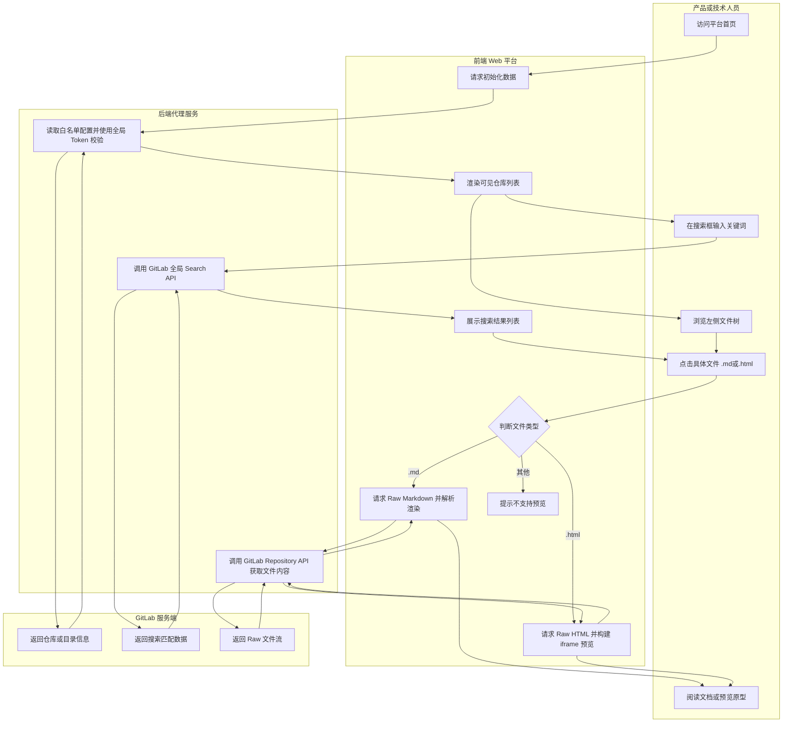

# 业务流程图 (Business Flow)

## 1. 核心流程描述
本系统作为一个纯前端代理展示平台，其核心业务流程主要围绕“文件检索”和“内容渲染”展开。
1.  **初始化与鉴权**：用户访问系统首页，系统前端向后端请求“可见仓库白名单”。后端使用预置的全局只读 Token 向 GitLab API 确认权限并返回仓库列表。
2.  **文件树浏览**：用户点击某个仓库，前端按需（懒加载）请求该仓库的目录树结构并渲染。
3.  **全局搜索**：用户在顶部输入关键词，后端代理请求 GitLab 的跨项目 Search API，并将匹配结果返回给前端展示。
4.  **文件阅读与预览**：
    *   当用户点击 `.md` 文件时：前端获取 Raw 文件内容，通过 Markdown 解析器转换为 HTML，并调用 Mermaid.js 渲染图表，最后在右侧主视图展示。
    *   当用户点击 `.html` 文件时：前端获取 Raw 文件内容，构建一个安全的 `iframe` 或直接在新窗口打开，以网页形式预览该 HTML。
    *   其他不支持的文件类型：提示无法预览或提供下载链接。

## 2. 业务流程图 (泳道图)

