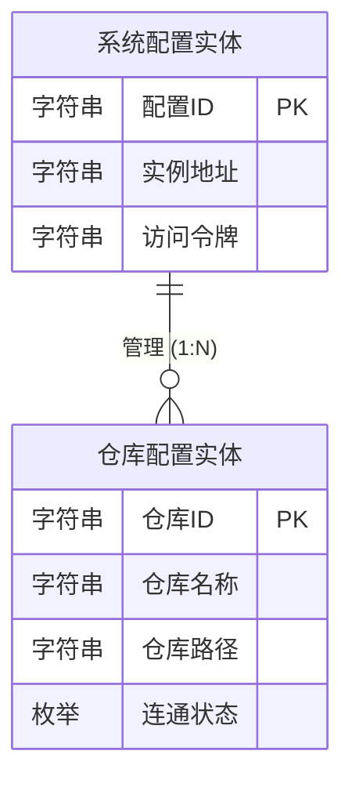
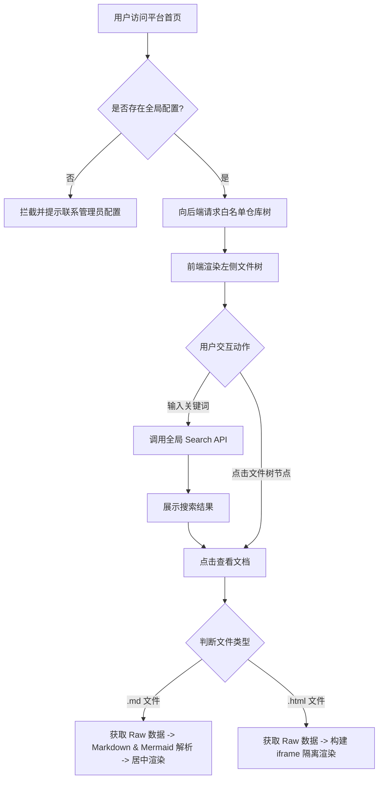

# 产品需求文档 (PRD) - PRD Reader (基于 GitLab 的文件查看系统)

## 1. 文档概述 (Document Overview)

### 1.1 产品背景与目标
当前团队中，产品经理和技术人员需要频繁查看存放在 GitLab 中的 PRD 文档（Markdown 格式）以及设计原型（HTML 格式）。GitLab 原生界面偏向代码托管，阅读体验欠佳，且不支持单文件 HTML 的直接渲染预览。
本项目旨在打造一个“基于 GitLab 的只读文件查看系统（PRD Reader）”，通过全局只读账号配置可见仓库白名单，为产品和技术团队提供一个沉浸式、交互友好、支持跨项目检索的 Web 阅读平台。

### 1.2 核心范围
*   **配置管理**：后台配置 GitLab 实例地址、全局只读访问令牌（Token）及可见仓库白名单。
*   **文件检索**：跨项目全文搜索，抽屉式文件资源树浏览。
*   **内容渲染**：支持 Markdown（含 Mermaid 图表）的沉浸式居中排版阅读，支持单文件 HTML 原型的网页隔离预览。

---

## 2. 用户角色与核心场景 (User Roles & Scenarios)

### 2.1 用户画像
| 角色 | 核心特征 | 核心痛点 |
| :--- | :--- | :--- |
| **产品经理 (PM)** | 频繁查阅 PRD、流程图及交互原型。依赖图形化界面。 | GitLab 上 MD 渲染效果一般，无法预览 HTML；跨仓库找文档困难。 |
| **技术人员 (Dev)** | 查阅需求文档进行开发评估。 | 频繁对照 PRD 和原型，原生界面跳转繁琐，无法直观查看 Mermaid 架构图。 |
| **系统管理员** | 负责系统初始化配置。 | 默认全量拉取会暴露敏感代码仓库，信息噪音大。 |

### 2.2 核心场景
| 场景名称 | 触发条件与环境 | 核心动作 | 期望结果 |
| :--- | :--- | :--- | :--- |
| **配置白名单** | 系统初始化或新增业务线时。 | 后台配置允许读取的 GitLab 仓库列表。 | 前台仅展示白名单内的仓库及其文件树。 |
| **文件树浏览** | 日常阅读文档时。 | 鼠标移至屏幕左侧唤出文件树，可下钻目录或复制链接。 | 像本地文件系统一样图形化浏览文档。 |
| **沉浸式阅读** | 评审或开发阶段仔细阅读时。 | 点击 `.md` 文件。 | 右侧渲染排版精美的文档，带独立 TOC 目录。 |
| **原型预览** | 查看前端切图或高保真交互原型时。 | 点击 `.html` 单文件。 | 直接以网页形式渲染该 HTML 文件演示效果。 |

---

## 3. 名词字典与实体关系图 (Data & ER Model)

### 3.1 业务名词
| 业务名词 | 业务含义与约束 |
| :--- | :--- |
| **全局访问令牌** | 具有 `read_api` 权限的 GitLab 个人或项目访问令牌，系统代理请求时统一使用该令牌，前端用户无需单独登录。 |
| **仓库白名单** | 允许在前台展示的 GitLab 仓库列表。不在白名单中的仓库对前端用户绝对不可见。 |
| **下钻导航** | 在左侧文件树中，将某一文件夹提升为临时“根目录”的浏览模式，以便于专注阅读深层目录。 |

### 3.2 名词字典与实体属性 (Entities)

#### 3.2.1 仓库配置实体
| 字段名称 | 字段类型 | 限制/长度 | 必填 | 业务含义 |
| :--- | :--- | :--- | :--- | :--- |
| `仓库ID` | 字符串 | 64字符 | 是 | GitLab 中的 Project ID 或完整 Path。 |
| `仓库名称` | 字符串 | 最长100字符 | 是 | 仓库的展示名称（如“前端核心项目”）。 |
| `仓库路径` | 字符串 | 255字符 | 是 | 仓库的 Namespace 路径（如 `company/frontend-core`）。 |
| `连通状态` | 枚举 | `正常`, `异常` | 是 | 记录系统是否能通过 Token 成功访问该仓库。 |

#### 3.2.2 系统配置实体
| 字段名称 | 字段类型 | 限制/长度 | 必填 | 业务含义 |
| :--- | :--- | :--- | :--- | :--- |
| `配置ID` | 字符串 | 32字符 | 是 | 配置的唯一标识。 |
| `实例地址` | 字符串 | 255字符 | 是 | GitLab 服务的根域名（如 `https://gitlab.com`）。 |
| `访问令牌` | 字符串 | 255字符 | 是 | 用于代理鉴权的 Token（如 `glpat-xxx`）。 |

### 3.3 实体关系图 (ER Diagram)

---

## 4. 流程结构 (Flow Structure)

### 4.1 核心业务流程

---

## 5. 全局规则 (Global Rules)

### 5.1 视觉与交互全局规范
- **隐藏滚动条**：全站所有区域（主阅读区、侧边栏、独立 TOC、配置页等）强制隐藏滚动条（`::-webkit-scrollbar { display: none; }`），但保留正常的鼠标滚轮/触控板滚动能力，保持极致的清新整洁。
- **抽屉式隐形触发**：包含顶部导航栏和左侧文件树。默认状态均为收起隐藏。用户将鼠标贴近屏幕边缘（左侧 40px，顶部 20px）时自动滑出。滑出的面板均提供“固定 (Pin)”按钮。
- **剪贴板操作反馈**：所有“复制 GitLab 地址”的操作，点击后图标需原位变为绿色的打勾图标（停留 2 秒），随后恢复为复制图标，给予明确的成功反馈。

---

## 6. 功能模块与页面细节 (Functional Specs)

### 6.1 首页阅读模块 (`index.html`)

#### 6.1.1 页面整体说明
- **页面概述**：用户日常阅读文档的核心工作台。采用极简的清新阅读风（Notion 风格），核心分为隐藏式顶部导航、隐藏式左侧资源树、居中的主阅读区、以及右侧独立目录树。
- **页面全局异常**：若当前白名单为空或 Token 失效，主阅读区居中展示缺省图及文案：“暂无可见仓库，请联系管理员配置”。

#### 6.1.2 顶部隐藏导航栏
- **区域介绍与规则**：承载全局搜索与当前路径面包屑。采用顶部抽屉式滑出交互。
- **展示元素定义**：
    | 元素名称 | 逻辑 (数据来源/计算逻辑) | 限制与格式 |
    | :--- | :--- | :--- |
    | 面包屑导航 | 提取当前阅读文件的层级路径（如 `仓库 / 文件夹 / 文件名`） | 灰色胶囊背景，层级间用 `/` 分隔，当前文件加粗深色展示。 |
    | 全局搜索框 | 用户输入关键词 | 胶囊形输入框，带放大镜图标。 |
    | 固定按钮 | 控制导航栏是否常驻显示 | 图钉图标，固定时呈高亮品牌色（粉色）。 |
- **区域交互**：
    - **滑出/收起**：鼠标移入页面顶部 20px 区域时，导航栏向下滑出；移出该区域（且未点击固定）时向上收起。
    - **固定动作**：点击图钉按钮，导航栏常驻展示，不再自动收起。

#### 6.1.3 左侧抽屉式文件树
- **区域介绍与规则**：树状展示所有可见仓库的目录结构。支持无限层级嵌套，支持单层级下钻专注阅读。
- **展示元素定义**：
    | 元素名称 | 逻辑 (数据来源/计算逻辑) | 限制与格式 |
    | :--- | :--- | :--- |
    | 系统标题 | 固定文案“PRD Reader” | 伴随粉、黄、蓝三个彩色圆点 Logo。 |
    | 仓库/文件夹节点 | `仓库名称` 或 `文件夹名称` | 带有 Chevron 展开/折叠箭头，仓库带云朵图标，文件夹带黄色文件夹图标。 |
    | 文件节点 | `文件名称` | `.md` 带灰色文件图标，`.html` 带橙色显示器图标，当前选中项高亮蓝色背景。 |
    | 复制地址按钮 | 对应节点的 GitLab Web URL | 仅鼠标悬停在对应行时显现。 |
    | 下钻目录按钮 | 将当前文件夹设为根节点 | 仅鼠标悬停在仓库/文件夹行时显现（箭头向右入线图标）。 |
    | 返回上级按钮 | 仅在下钻模式下，展示在树结构最顶部 | 蓝色字体的“返回上级”及左箭头。 |
- **区域交互**：
    - **滑出/收起**：鼠标移入左侧 40px 区域滑出，移出收起。支持点击图钉固定，固定时挤压右侧主视图空间。
    - **下钻导航 (Drill-down)**：点击文件夹右侧的“进入目录”按钮，树结构过滤，仅展示该节点及其子节点，取消缩进，并显示“返回上级”按钮。点击“返回上级”恢复完整文件树。

#### 6.1.4 右侧沉浸式阅读区
- **区域介绍与规则**：核心内容展示区。采用 `mx-auto` 居中对齐排版，限制最大宽度（`max-w-3xl`），保证最佳阅读视宽。
- **展示元素定义**：
    | 元素名称 | 逻辑 (数据来源/计算逻辑) | 限制与格式 |
    | :--- | :--- | :--- |
    | H1 大标题 | Markdown 解析出的一级标题 | 字体加粗，底部带有半透明黄色高光下划线装饰。 |
    | H2 标题 | Markdown 解析出的二级标题 | 标题前方带有粉色小花 `✿` 装饰符。 |
    | 正文与代码块 | Markdown 内容 | 行距 1.7，代码块带淡色背景及圆角。 |
    | 图表区块 | 识别 `mermaid` 语法块拦截渲染 | 渲染为清晰的 SVG 矢量图，居中展示。 |

#### 6.1.5 右侧独立目录树 (TOC)
- **区域介绍与规则**：在屏幕最右侧独立划出的悬浮目录区域，仅在渲染 Markdown 时展示。
- **展示元素定义**：
    | 元素名称 | 逻辑 (数据来源/计算逻辑) | 限制与格式 |
    | :--- | :--- | :--- |
    | 目录大纲 | 提取主阅读区内所有 H1/H2 标题生成 | 树状缩进。二级标题前带有粉色/灰色小圆点引导线。 |
- **区域交互**：点击目录项，主阅读区平滑滚动至对应锚点位置。

#### 6.1.6 底部管理员入口与验证弹窗
- **区域介绍与规则**：侧边栏底部的“后台配置”入口，点击需校验密码以防止普通用户误操作。
- **展示元素定义 (弹窗)**：
    | 元素名称 | 逻辑 (数据来源/计算逻辑) | 限制与格式 |
    | :--- | :--- | :--- |
    | 密码输入框 | 用户输入 | 密码掩码显示，带锁图标。 |
    | 错误提示文案 | 默认隐藏 | 红色小字“密码错误，请重试。(初始密码为: Aa@000000)”。 |
    | 确认按钮 | 固定文案“确认进入” | 蓝色大按钮。 |
- **区域交互**：
    - 点击侧边栏底部“后台配置”，弹出全屏毛玻璃遮罩层及密码输入框。
    - **校验逻辑**：输入 `Aa@000000` 点击确认（或回车），跳转至 `admin.html`。
    - **异常校验**：输入错误时，输入框边框变红，展示错误文案，且弹窗本体触发轻微的“震动（Pulse）”动画反馈。

### 6.2 后台配置模块 (`admin.html`)

#### 6.2.1 页面整体说明
- **页面概述**：系统管理员使用的控制台。提供 GitLab 实例级连接配置及可见仓库的精准管控。

#### 6.2.2 全局 Token 配置区
- **展示元素定义**：
    | 元素名称 | 逻辑 (数据来源/计算逻辑) | 限制与格式 |
    | :--- | :--- | :--- |
    | 连接状态 | 系统校验结果 | 绿色呼吸灯圆点 + “已连接”字样。 |
    | 实例地址输入框 | `系统配置实体.实例地址` | 默认填入 `https://gitlab.com`。 |
    | 访问令牌输入框 | `系统配置实体.访问令牌` | 密码掩码形式，右侧提供“小眼睛”图标切换明文显示。 |
    | 测试连接/保存按钮 | 触发对应操作 | 按钮悬浮带有向上微移的物理投影效果。 |

#### 6.2.3 仓库白名单管理区
- **展示元素定义**：
    | 元素名称 | 逻辑 (数据来源/计算逻辑) | 限制与格式 |
    | :--- | :--- | :--- |
    | 仓库添加输入框 | 用户输入 ID 或 Path | 占位符“例如: 12345 或 group/project”。 |
    | 仓库列表卡片 | 遍历 `仓库配置实体` | 左侧展示仓库名称缩写（Logo）及完整路径，右侧展示绿色“正常”状态。 |
    | 移除按钮 | 触发删除逻辑 | 仅鼠标悬停在对应卡片时，右侧显现红色的垃圾桶图标。 |
- **区域交互**：
    - 点击垃圾桶图标，直接将对应仓库从列表中移除，无需二次弹窗确认（追求配置的高效性）。
    - 移除后，前台用户刷新页面时左侧文件树将不再展示该仓库。
    
---
*(文档结束)*