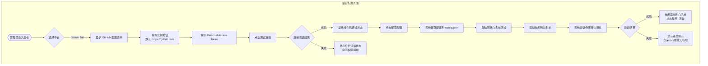
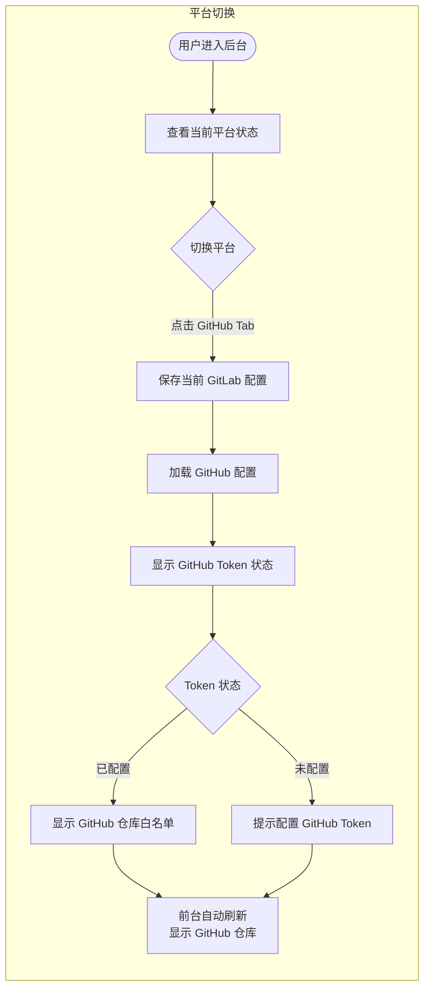
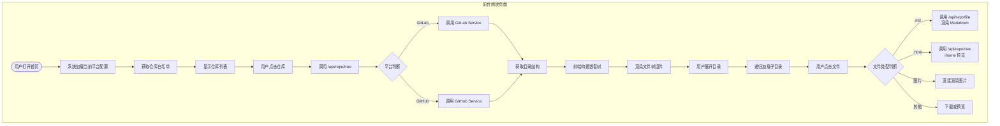
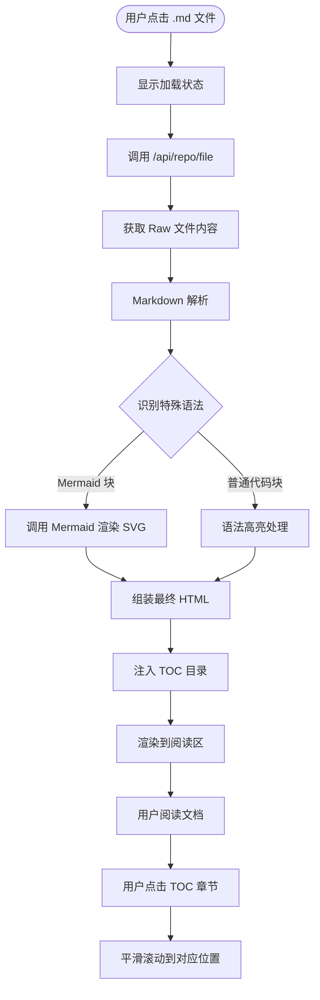
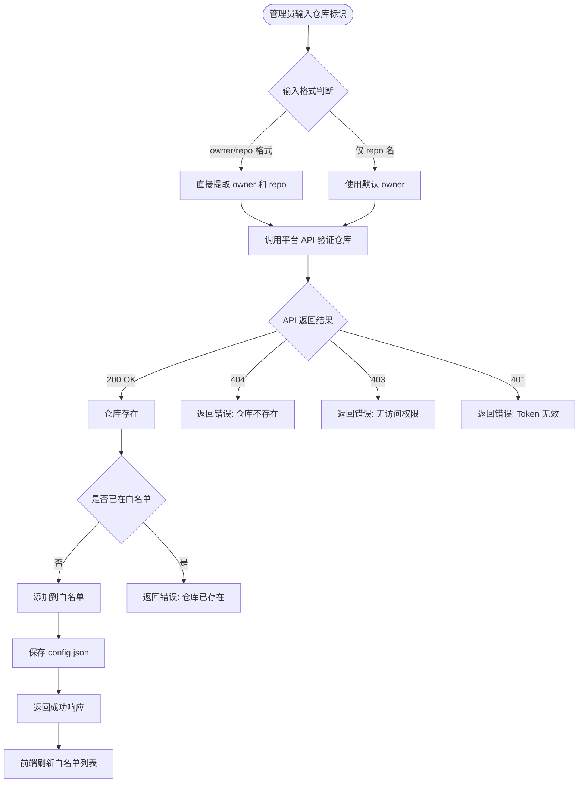
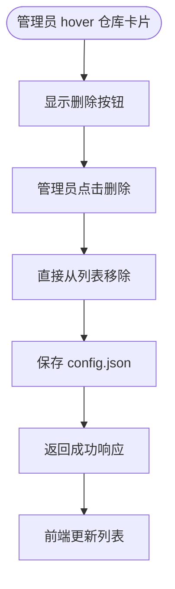
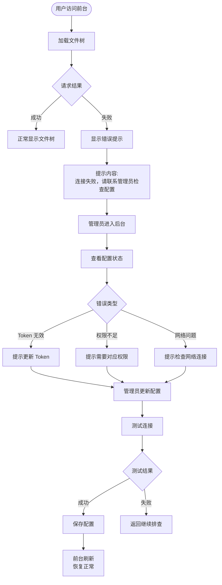

# 业务流程图 (Business Flow)

## 1. 业务流程概述

本文档描述了 GitHub 集成功能的核心业务流程，包括平台配置、平台切换、文件浏览和仓库白名单管理等关键场景。

---

## 2. 平台配置与管理流程

### 2.1 管理员配置 GitHub 平台



**关键节点说明**：

| 节点 | 说明 |
|:---|:---|
| 测试连接 | 调用 GitHub API `/user` 验证 Token 有效性 |
| 保存配置 | 将 GitHub 配置写入 `config.json` 的 `github` 字段 |
| 添加仓库 | 调用 GitHub API `/repos/{owner}/{repo}` 验证仓库可访问性 |

---

### 2.2 平台切换流程



**关键约束**：
- 切换平台时自动保存当前平台的配置
- 两个平台的配置独立存储，切换时完整加载
- 前台文件树自动刷新显示新平台的数据

---

## 3. 文件浏览流程

### 3.1 用户浏览仓库文件



---

### 3.2 Markdown 文档阅读流程



---

## 4. 仓库白名单管理流程

### 4.1 添加仓库到白名单



---

### 4.2 删除仓库从白名单



**关键设计决策**：
- **无二次确认**：删除操作直接执行，不弹出确认对话框（遵循现有交互设计）

---

## 5. 异常处理流程

### 5.1 平台连接异常处理



---

## 6. 数据流转总图

```mermaid
flowchart LR
    subgraph 前端
        A[Admin.tsx]
        B[Reader.tsx]
        C[Home.tsx]
    end

    subgraph Zustand Store
        D[configStore]
        E[readerStore]
    end

    subgraph Express Routes
        F[/api/config]
        G[/api/repo/tree]
        H[/api/repo/file]
        I[/api/repo/raw]
    end

    subgraph Services
        J[configService]
        K[gitlabService]
        L[githubService]
    end

    subgraph External APIs
        M[GitLab API]
        N[GitHub API]
    end

    A -->|配置管理| D
    B -->|文件操作| E
    C -->|加载仓库| D
    D --> F
    E --> G
    E --> H
    E --> I
    F --> J
    G -->|platform=gitlab| K
    G -->|platform=github| L
    H --> K
    H --> L
    I --> K
    I --> L
    K --> M
    L --> N
    J -->|读写| O[(config.json)]
```

---

## 7. 流程关键节点汇总

| 流程名称 | 关键节点 | 异常处理 |
|:---|:---|:---|
| 配置 GitHub | 测试连接 → 保存配置 → 添加仓库 | Token 无效、权限不足 |
| 平台切换 | 加载配置 → 刷新文件树 | 配置为空、连接失败 |
| 文件浏览 | 加载文件树 → 渲染文件 → 渲染内容 | 网络超时、文件不存在 |
| 白名单管理 | 验证仓库 → 添加/删除 | 仓库已存在、无访问权限 |
