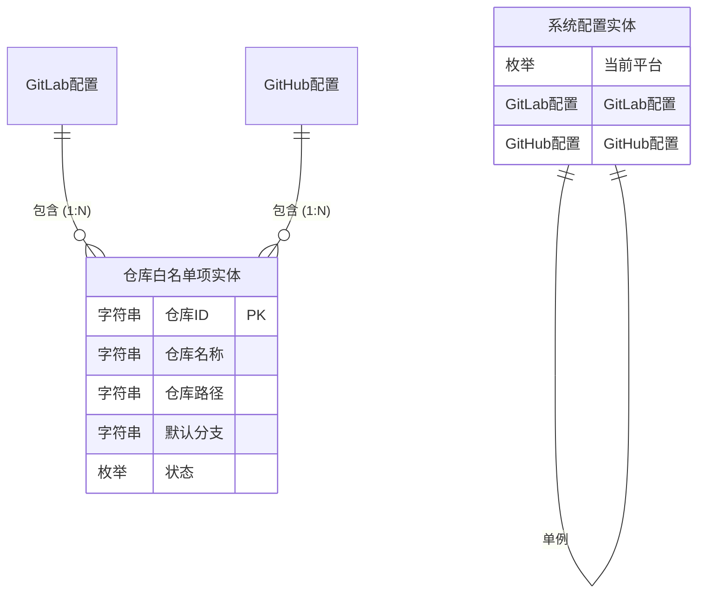
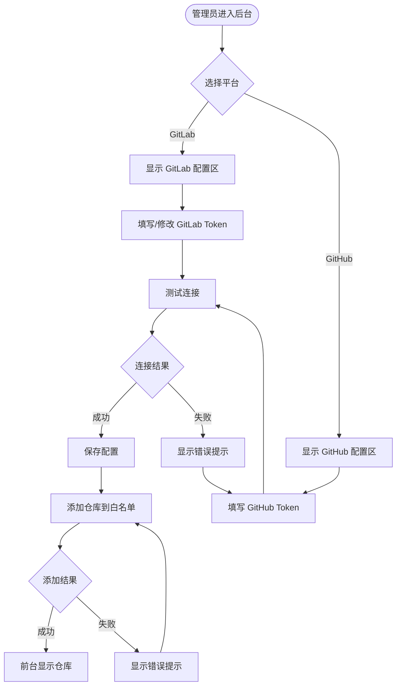
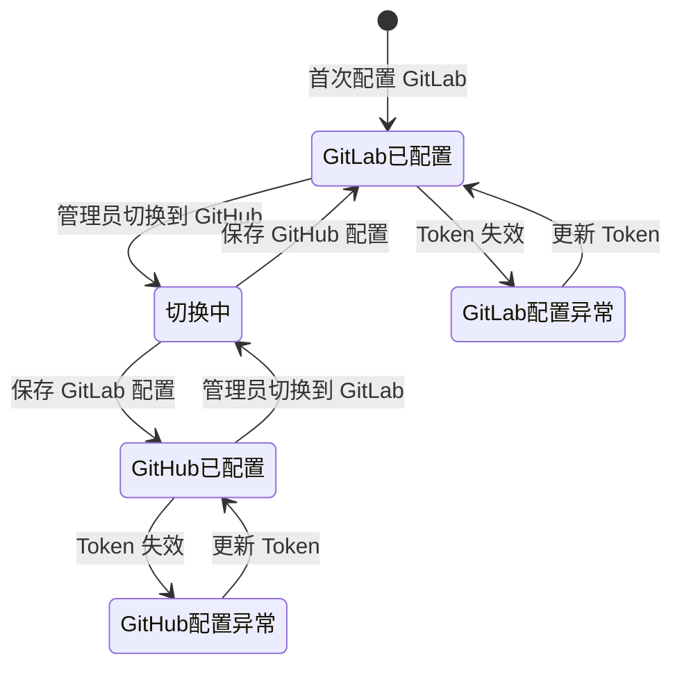
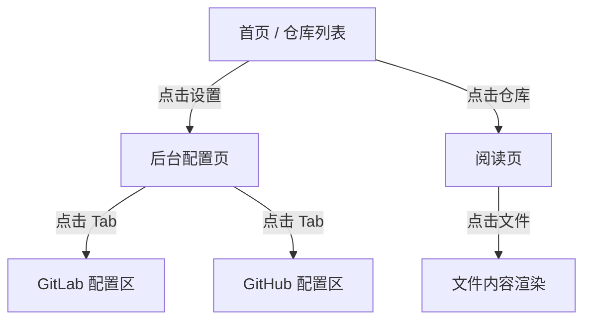

# 产品需求文档 (PRD) - GitHub 集成功能

> **文档说明**：
> 本文档描述了 PRD-Reader 系统中 GitHub 集成功能的产品需求，包括平台切换、配置管理、仓库白名单等核心功能。

***

## 1. 文档信息 (Document Information)

### 1.1 修订记录

| 版本号 | 变更日期 | 变更内容 | 变更人 |
| :--- | :--- | :--- | :--- |
| v1.0 | 2026-04-09 | 初始版本创建，完成 GitHub 集成功能需求定义 | 产品经理 |

### 1.2 关联文档链接

- [需求背景](./Background/Requirement_Background.md)
- [用户故事](./Background/User_Stories.md)
- [业务流程图](./Flow/Business_Flow.md)
- [页面结构](./Page_Structure.md)
- [高保真 UI 原型](./Prototypes/admin.html)

***

## 2. 背景 (Background)

### 2.1 项目概述与目标

PRD-Reader 是一款基于代码托管平台的只读文件查看系统，旨在为产品经理和技术人员提供沉浸式、图形化的文档阅读体验。

**本次迭代目标**：

1. 在现有 GitLab 文件查看系统的基础上，扩展支持 GitHub 平台
2. 实现平台灵活切换，管理员可在后台配置选择使用 GitLab 或 GitHub 平台
3. 两个平台的配置信息（Token、白名单）独立存储，切换时自动加载对应配置
4. GitHub 平台支持与 GitLab 相同的核心功能（文件树浏览、Markdown 渲染、HTML 预览、图片查看）

### 2.2 用户画像 (User Personas)

| 角色名称 | 核心特征 | 核心痛点 | 核心诉求 |
| :--- | :--- | :--- | :--- |
| **系统管理员** | 负责系统初始化和平台配置。熟悉 GitLab/GitHub 基本操作，了解 Token 权限配置。 | 1. 当前系统仅支持 GitLab，无法切换到 GitHub；<br>2. 需要为不同平台维护独立的配置信息。 | 希望配置过程简单直观，平台切换无缝衔接；需要清晰的权限指引避免配置错误。 |
| **产品经理 (PM)** | 频繁查阅 PRD、流程图及交互原型。不熟悉 Git 命令行，依赖图形化界面。 | 1. 部分项目托管在 GitHub，无法使用 PRD-Reader 查看；<br>2. 需要在不同平台间切换，效率低下。 | 偏好直观的文件夹树状结构和所见即所得的文档渲染体验；希望平台切换对用户透明。 |
| **技术人员 (Dev)** | 查阅需求文档进行开发评估。熟悉 GitLab/GitHub 但希望有更纯粹的阅读体验。 | 开源项目或外部合作项目托管在 GitHub，无法统一查看；需要频繁对照 PRD 和原型。 | 追求高效的跨项目全文检索，要求 Markdown 和 Mermaid 图表能准确渲染。 |

### 2.3 用户故事 (User Stories)

**作为** 系统管理员，
**我希望** 在后台配置页面选择代码托管平台（GitLab 或 GitHub），
**以便于** 根据团队需求切换使用不同的平台。

**验收标准**：

- 后台配置页面顶部显示平台选择器（Tab 页签形式）
- 切换平台时，下方配置区域自动更新为对应平台的配置项
- 切换平台时，白名单区域自动更新为对应平台的仓库列表
- 平台选择状态持久化保存

### 2.4 用户旅程 (User Journey)

| 阶段 | 1. 配置平台 | 2. 添加仓库 | 3. 浏览文件 | 4. 阅读文档 |
| :--- | :--- | :--- | :--- | :--- |
| **用户行为** | 进入后台，选择平台 Tab，填写 Token 并测试连接。 | 在白名单区域添加 GitHub 仓库路径。 | 在前台首页点击仓库，展开文件树浏览目录。 | 点击 Markdown 文件，在右侧阅读区查看渲染后的文档。 |
| **接触触点** | 平台选择 Tab、Token 输入框、测试连接按钮 | 添加仓库输入框、仓库卡片列表 | 文件树组件、仓库节点、文件夹节点 | Markdown 渲染区、TOC 目录 |

***

## 3. 名词字典与实体关系 (Data & ER Model)

### 3.1 业务概念

| 业务名词 | 业务含义与约束 |
| :--- | :--- |
| **平台类型** | 代码托管平台的类型枚举，取值范围为 `gitlab` 或 `github`。 |
| **Personal Access Token** | 个人访问令牌，用于 API 鉴权的凭证字符串。GitHub 格式为 `ghp_` 开头。 |
| **仓库白名单** | 允许在前台展示的仓库列表，未添加到此列表的仓库不可见。 |
| **仓库路径** | 仓库在平台中的完整路径，格式为 `owner/repository`（如 `facebook/react`）。 |

### 3.2 名词字典与实体属性 (Entities)

#### 3.2.1 系统配置实体

| 字段名称 | 字段类型 | 限制/长度 | 必填 | 业务含义 |
| :--- | :--- | :--- | :--- | :--- |
| `当前平台` | 枚举 | `gitlab`, `github` | 是 | 当前激活的代码托管平台。 |
| `GitLab配置` | 对象 | - | 是 | GitLab 平台的配置信息。 |
| `GitHub配置` | 对象 | - | 是 | GitHub 平台的配置信息。 |

#### 3.2.2 平台配置实体（通用结构）

| 字段名称 | 字段类型 | 限制/长度 | 必填 | 业务含义 |
| :--- | :--- | :--- | :--- | :--- |
| `实例地址` | 字符串 | 最长 255 字符 | 是 | 平台的 API 地址（如 `https://github.com`）。 |
| `访问令牌` | 字符串 | 最长 255 字符 | 是 | 用于 API 鉴权的 Token，存储时需加密。 |
| `仓库白名单` | 数组 | - | 是 | 该平台下允许访问的仓库列表。 |
| `连接状态` | 枚举 | `已连接`, `未连接`, `异常` | 是 | 当前平台的连接状态。 |

#### 3.2.3 仓库白名单项实体

| 字段名称 | 字段类型 | 限制/长度 | 必填 | 业务含义 |
| :--- | :--- | :--- | :--- | :--- |
| `仓库ID` | 字符串 | 32 字符 | 是 | 仓库的唯一标识符。 |
| `仓库名称` | 字符串 | 最长 100 字符 | 是 | 仓库的显示名称。 |
| `仓库路径` | 字符串 | 最长 255 字符 | 是 | 仓库的完整路径（如 `owner/repo`）。 |
| `默认分支` | 字符串 | 最长 100 字符 | 是 | 仓库的默认分支名称（如 `main`）。 |
| `状态` | 枚举 | `正常`, `异常` | 是 | 仓库的访问状态。 |

### 3.3 实体关系图 (ER Diagram)



***

## 4. 流程结构 (Flow Structure)

### 4.1 主流程及分支流程



### 4.2 核心状态机（平台切换状态）



### 4.3 页面信息结构与跳转



***

## 5. 全局规则 (Global Rules)

*注：本章节定义跨越所有页面的底层共性规则，特定页面的展示与交互规则请见第 6 节。*

### 5.1 平台切换规则

- 两个平台的配置信息独立存储，互不影响。
- 切换平台时，系统自动保存当前平台的配置。
- 切换平台后，前台文件树自动刷新，显示新平台的仓库列表。
- 平台切换响应时间应小于 1 秒。

### 5.2 配置保存规则

- 配置保存后立即生效，无需重启服务。
- Token 存储时需加密处理，接口返回时脱敏显示（如 `ghp_xxxxxx...`）。
- 配置变更记录应支持审计追溯（记录变更时间和操作类型）。

### 5.3 全局异常与容错策略

- **接口防抖**：所有涉及写操作的按钮，点击后必须立即变为 `Loading` 状态，防止连点重复提交。
- **错误提示**：统一使用 alert 或内联错误文字展示错误信息，避免多层级弹窗。
- **断网处理**：拦截网络请求错误，若超时（>8s）或无网络，在页面顶部弹出红色警告 Toast："网络开小差了，请检查网络设置后重试"。

***

## 6. 功能模块与页面细节 (Functional Specs)

### 6.1 后台配置页面 (Admin.tsx)

#### 6.1.1 页面整体说明

- **页面概述**：系统管理员配置代码托管平台的核心页面，支持平台切换、Token 配置和仓库白名单管理。
- **准入前置条件**：用户已通过管理员密码鉴权（默认密码 `Aa@000000`）。
- **页面结构与状态矩阵**：

| 页面状态 | 包含区域/弹窗 | 状态触发条件 |
| :--- | :--- | :--- |
| **GitLab 激活态** | 顶部导航区、平台选择 Tab（GitLab 高亮）、GitLab 配置区、GitLab 仓库白名单区 | 当前平台配置为 `gitlab`。 |
| **GitHub 激活态** | 顶部导航区、平台选择 Tab（GitHub 高亮）、GitHub 配置区、GitHub 仓库白名单区 | 当前平台配置为 `github`。 |
| **测试连接中** | 配置表单区域显示"测试中..."状态 | 用户点击"测试连接"按钮后。 |
| **测试连接成功** | 配置区显示绿色"已连接"状态标识 | Token 验证通过。 |
| **测试连接失败** | 配置区显示红色"连接失败"及错误原因 | Token 无效或权限不足。 |

***

#### 6.1.2 平台选择 Tab 区域

- **区域介绍与规则**：页面顶部居中展示两个 Tab 页签，用于切换 GitLab 和 GitHub 配置区域。
- **展示元素定义**：

| 元素名称 | 逻辑 (数据来源/计算逻辑) | 限制与格式 |
| :--- | :--- | :--- |
| GitLab Tab | 固定显示 GitLab Logo + "GitLab" 文案 | 激活态：蓝色背景（`#A2D2FF`）+ 白色文字；非激活态：灰色背景（`#F3F4F6`）+ 灰色文字。 |
| GitHub Tab | 固定显示 GitHub Logo + "GitHub" 文案 | 激活态：黑色背景（`#24292f`）+ 白色文字；非激活态：灰色背景（`#F3F4F6`）+ 灰色文字。 |

- **区域交互**：
  - **前置条件**：无。
  - **触发动作**：点击任意 Tab。
  - **结果呈现**：切换到对应平台的配置区域，原平台配置自动保存。
  - **异常与兜底**：切换时若当前平台配置未保存，自动触发保存操作。

***

#### 6.1.3 Token 配置区域

- **区域介绍与规则**：分为 GitLab 和 GitHub 两个版本，根据当前激活的 Tab 显示对应内容。顶部包含状态指示器和标题信息。
- **展示元素定义**：

| 元素名称 | 逻辑 (数据来源/计算逻辑) | 限制与格式 |
| :--- | :--- | :--- |
| 状态指示器 | 根据连接测试结果动态显示 | 成功：绿色圆点（呼吸动画）+ "已连接"；失败：红色文字 + 错误原因；未配置：不显示。 |
| 实例地址输入框 | 绑定平台配置的 `实例地址` 字段 | GitLab 默认 `https://gitlab.com`；GitHub 默认 `https://github.com`。 |
| Token 输入框 | 绑定平台配置的 `访问令牌` 字段 | 密码掩码显示，右侧有眼睛图标切换明文/密文。 |
| 权限说明文字 | 固定提示文案 | GitLab 提示需要 `read_api` 权限；GitHub 提示需要 `public_repo` + `repo` 权限。 |

- **区域交互**：
  - **前置条件**：无。
  - **触发动作 A**：点击眼睛图标。
  - **结果呈现 A**：切换 Token 输入框的显示模式（密码 ↔ 明文）。
  - **触发动作 B**：点击"测试连接"按钮。
  - **结果呈现 B**：调用平台 API 验证 Token，显示测试结果。
  - **触发动作 C**：点击"保存配置"按钮。
  - **结果呈现 C**：保存配置到 `config.json`，显示成功提示。

- **异常与兜底**：
  - Token 为空时点击测试连接，显示红色错误文字"请输入 Token"。
  - Token 格式无效时，显示红色错误文字"Token 格式无效"。

***

#### 6.1.4 仓库白名单区域

- **区域介绍与规则**：根据当前激活的 Tab 显示对应平台的仓库列表。顶部显示当前平台标签。
- **展示元素定义**：

| 元素名称 | 逻辑 (数据来源/计算逻辑) | 限制与格式 |
| :--- | :--- | :--- |
| 平台标签 | 固定显示当前平台名称 | GitLab：灰色背景 + 灰色文字；GitHub：黑色背景 + 白色文字。 |
| 添加仓库输入框 | 用户手动输入 | 占位符提示"例如: owner/repository"（GitHub）或"例如: 12345 或 group/project"（GitLab）。 |
| 添加按钮 | 固定文案"添加仓库" | 蓝色实心按钮，hover 时向上微移并加深阴影。 |
| 仓库卡片 | 遍历 `仓库白名单` 数组渲染 | 圆角卡片（20px），hover 时边框变深。 |
| 仓库名称缩写 | 取仓库名称前两个字符大写 | 白色背景圆形图标 + 灰色文字。 |
| 仓库名称 | `仓库白名单项.仓库名称` | 黑色加粗字体。 |
| 仓库路径 | `仓库白名单项.仓库路径` | 灰色等宽字体，字号 12px。 |
| 状态标签 | `仓库白名单项.状态` | 正常：绿色背景 + 绿色文字 + 勾选图标；异常：红色背景 + 红色文字。 |
| 删除按钮 | 固定显示垃圾桶图标 | 默认隐藏（`opacity-0`），hover 仓库卡片时显示；红色 hover 背景。 |

- **区域交互**：
  - **前置条件**：无。
  - **触发动作 A**：在输入框输入仓库路径后点击"添加仓库"按钮。
  - **结果呈现 A**：调用平台 API 验证仓库有效性，成功则添加到列表并显示成功 toast；失败则 alert 显示错误原因。
  - **触发动作 B**：hover 仓库卡片。
  - **结果呈现 B**：仓库卡片边框变深，删除按钮显现。
  - **触发动作 C**：点击删除按钮。
  - **结果呈现 C**：仓库直接从列表移除，无二次确认弹窗。

- **异常与兜底**：
  - 仓库已存在：alert 提示"仓库已存在"。
  - 仓库不存在（404）：alert 提示"仓库不存在或无访问权限"。
  - Token 无效（401）：alert 提示"Token 无效，请检查配置"。

***

### 6.2 首页 (Home.tsx) - 保持不变

#### 6.2.1 页面整体说明

- **页面概述**：用户访问系统的默认落地页，展示当前平台的仓库列表。
- **准入前置条件**：用户已配置至少一个平台的 Token 和仓库白名单。
- **页面结构与状态矩阵**：

| 页面状态 | 包含区域/弹窗 | 状态触发条件 |
| :--- | :--- | :--- |
| **有仓库态** | 顶部导航区、平台标识区、仓库卡片列表 | 白名单中至少有一个仓库。 |
| **无仓库态** | 顶部导航区、平台标识区、缺省页提示 | 白名单为空。 |

***

#### 6.2.2 平台标识区域

- **区域介绍与规则**：仓库列表顶部居中显示当前平台标识。
- **展示元素定义**：

| 元素名称 | 逻辑 (数据来源/计算逻辑) | 限制与格式 |
| :--- | :--- | :--- |
| 平台文案 | `当前平台` 配置项 | 固定文案"当前平台: GitLab"或"当前平台: GitHub"。 |
| 平台图标 | 根据平台类型显示对应 SVG 图标 | GitLab 橙色狐狸图标；GitHub 黑色猫头鹰图标。 |

***

#### 6.2.3 仓库卡片列表

- **区域介绍与规则**：垂直滚动列表，每个卡片代表一个可访问的仓库。
- **展示元素定义**：

| 元素名称 | 逻辑 (数据来源/计算逻辑) | 限制与格式 |
| :--- | :--- | :--- |
| 仓库图标 | 固定显示 ☁️ 云朵图标 | 表示仓库节点。 |
| 仓库名称 | `仓库白名单项.仓库名称` | 黑色加粗字体。 |
| 仓库描述 | 固定文案或留空 | 可选显示"PRD 文档与设计资源"等描述。 |

- **区域交互**：
  - **前置条件**：白名单中存在仓库。
  - **触发动作**：点击仓库卡片。
  - **结果呈现**：跳转到阅读页，加载该仓库的文件树。

***

### 6.3 阅读页面 (Reader.tsx) - 保持不变

#### 6.3.1 页面整体说明

- **页面概述**：核心阅读工作台，提供文件树浏览和文档渲染功能。
- **准入前置条件**：用户已在首页点击了某个仓库。
- **页面结构与状态矩阵**：

| 页面状态 | 包含区域/弹窗 | 状态触发条件 |
| :--- | :--- | :--- |
| **文件树加载中** | 左侧文件树显示 loading 动画 | 正在获取目录结构。 |
| **文件树加载失败** | 左侧文件树显示错误提示 | API 请求失败。 |
| **文件树正常** | 左侧文件树显示目录结构 | API 请求成功。 |
| **Markdown 渲染态** | 右侧阅读区渲染 Markdown + TOC | 用户点击 `.md` 文件。 |
| **HTML 预览态** | 右侧阅读区 iframe 隔离渲染 | 用户点击 `.html` 文件。 |
| **图片查看态** | 右侧阅读区直接渲染图片 | 用户点击图片文件。 |

***

#### 6.3.2 左侧文件树抽屉

- **区域介绍与规则**：默认收起的抽屉式文件树，鼠标靠近屏幕左侧 40px 边缘时自动滑出。
- **展示元素定义**：

| 元素名称 | 逻辑 (数据来源/计算逻辑) | 限制与格式 |
| :--- | :--- | :--- |
| 仓库节点 | 显示 ☁️ 图标 + 仓库名称 | 点击展开该仓库的根目录。 |
| 文件夹节点 | 显示 📁 图标 + Chevron 展开箭头 | 点击展开/折叠子节点。 |
| 文件节点 | 根据文件类型显示对应图标 | `.md`：📄 图标；`.html`：🖥️ 图标；图片：🖼️ 图标；其他：📋 图标。 |
| 固定按钮 | 右上角图钉图标 | 点击固定文件树，防止自动收起。 |

- **区域交互**：
  - **前置条件**：无。
  - **触发动作 A**：鼠标靠近屏幕左侧 40px 边缘。
  - **结果呈现 A**：文件树抽屉自动滑出。
  - **触发动作 B**：鼠标离开文件树区域。
  - **结果呈现 B**：文件树抽屉自动收起（除非已点击固定按钮）。

***

#### 6.3.3 右侧阅读区

- **区域介绍与规则**：居中展示阅读内容，最大宽度 `48rem`（768px）。
- **展示元素定义**：

| 元素名称 | 逻辑 (数据来源/计算逻辑) | 限制与格式 |
| :--- | :--- | :--- |
| Markdown 内容 | 调用 `/api/repo/file` 获取原始内容后渲染 | 支持 Mermaid 图表渲染、代码块语法高亮。 |
| TOC 目录 | 右侧悬浮，从 Markdown H1/H2 自动生成 | 仅 `.md` 文件渲染时显示。 |
| iframe 预览 | 调用 `/api/repo/raw/*` 作为 src | 隔离渲染 HTML 原型。 |
| 图片渲染 | 调用 `/api/repo/raw/*` 作为 src | 支持 PNG/JPG/SVG/WEBP。 |

- **区域交互**：
  - **前置条件**：用户点击了文件节点。
  - **触发动作 A**：点击 TOC 目录项。
  - **结果呈现 A**：平滑滚动到对应章节。
  - **触发动作 B**：滚动阅读区内容。
  - **结果呈现 B**：TOC 目录高亮当前章节。

***

### 6.4 新增/修改组件清单

| 组件名称 | 组件类型 | 所属页面 | 说明 |
| :--- | :--- | :--- | :--- |
| `PlatformTabs` | 功能组件 | Admin.tsx | 平台选择 Tab 页签，支持 GitLab/GitHub 切换 |
| `GitHubConfigForm` | 功能组件 | Admin.tsx | GitHub 平台配置表单（实例地址 + Token） |
| `RepositoryCard` | UI 组件 | Admin.tsx | 仓库卡片，支持 hover 显示删除按钮 |
| `StatusIndicator` | UI 组件 | Admin.tsx | 连接状态指示器（已连接/连接失败） |
| `TokenInput` | UI 组件 | Admin.tsx | Token 输入框，支持显示/隐藏切换 |
| `RepoListEmptyState` | UI 组件 | Admin.tsx | 仓库列表空状态提示 |

***

### 6.5 技术实现约束

#### 6.5.1 前端约束

- **框架**：React 18 + TypeScript
- **路由**：`react-router-dom`
- **状态管理**：Zustand（configStore 管理平台配置，readerStore 管理文件树）
- **样式**：Tailwind CSS，遵循现有 CSS 变量规范
- **图标**：Lucide React

#### 6.5.2 后端约束

- **运行环境**：Node.js + Express
- **API 路由**：
  - `GET /api/config` - 获取完整配置（含双平台配置）
  - `POST /api/config` - 保存配置
  - `POST /api/config/test` - 测试连接
  - `GET /api/repo/tree` - 获取文件树（根据 platform 调用对应服务）
  - `GET /api/repo/file` - 获取文件内容
  - `GET /api/repo/raw/*` - 获取静态资源
- **服务层**：
  - `configService.ts` - 读写 config.json
  - `gitlabService.ts` - GitLab API 调用（现有）
  - `githubService.ts` - GitHub API 调用（新增）

#### 6.5.3 配置数据结构

```json
{
  "platform": "gitlab" | "github",
  "gitlab": {
    "instanceUrl": "https://gitlab.com",
    "token": "glpat-xxx",
    "repositories": [
      {
        "id": "12345",
        "name": "仓库名称",
        "path": "group/project",
        "default_branch": "main",
        "status": "正常"
      }
    ]
  },
  "github": {
    "instanceUrl": "https://github.com",
    "token": "ghp-xxx",
    "repositories": [
      {
        "id": "123456",
        "name": "仓库名称",
        "path": "owner/repo",
        "default_branch": "main",
        "status": "正常"
      }
    ]
  }
}
```

***

## 附录

### A. GitHub API 权限说明

| 权限类型 | 权限名称 | 适用场景 |
| :--- | :--- | :--- |
| `public_repo` | 访问公共仓库 | 仅查看开源项目 |
| `repo` | 访问私有仓库 | 查看私有仓库（企业项目） |

### B. 错误码与错误信息对照表

| 错误场景 | 前端提示文案 | 管理员排查方向 |
| :--- | :--- | :--- |
| Token 为空 | "请输入 Token" | 检查 Token 输入框 |
| Token 格式无效 | "Token 格式无效" | GitHub Token 应以 `ghp_` 开头 |
| Token 无效/过期 | "Token 无效，请检查配置" | 重新生成 Personal Access Token |
| 权限不足 | "权限不足，需要 public_repo + repo 权限" | 在 GitHub 设置中勾选对应权限 |
| 仓库不存在 | "仓库不存在或无访问权限" | 检查仓库路径是否正确 |
| 仓库已存在 | "仓库已存在" | 无需重复添加 |
| 网络错误 | "网络开小差了，请检查网络设置后重试" | 检查网络连接 |

### C. 验收检查清单

| 功能模块 | 检查项 | 验收标准 |
| :--- | :--- | :--- |
| 平台切换 | Tab 切换流畅 | 切换时配置区域即时更新 |
| 平台切换 | 配置独立保存 | 切换回原平台时配置保留 |
| Token 配置 | 测试连接成功 | 显示绿色"已连接"标识 |
| Token 配置 | Token 脱敏显示 | 页面加载时 Token 以 `•••••` 形式显示 |
| 白名单管理 | 添加仓库成功 | 新仓库出现在列表中 |
| 白名单管理 | 删除仓库成功 | 仓库从列表移除，无确认弹窗 |
| 文件浏览 | 仓库列表展示 | 首页正确显示当前平台的仓库 |
| 文件浏览 | 文件树展开 | 点击仓库正确展开目录结构 |
| 文档渲染 | Markdown 渲染 | `.md` 文件正确渲染，包含 Mermaid 图表 |
| 文档渲染 | HTML 预览 | `.html` 文件在 iframe 中隔离渲染 |
| 异常处理 | 错误提示清晰 | 错误信息包含可能的原因和解决方案 |
