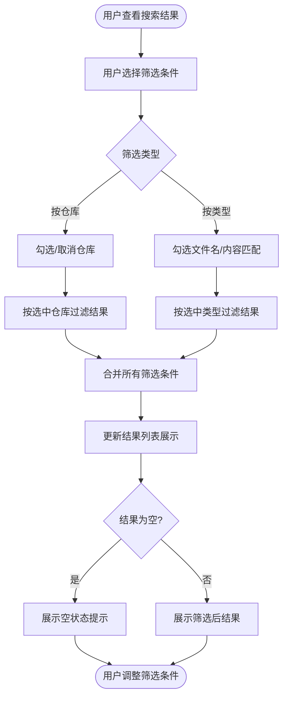
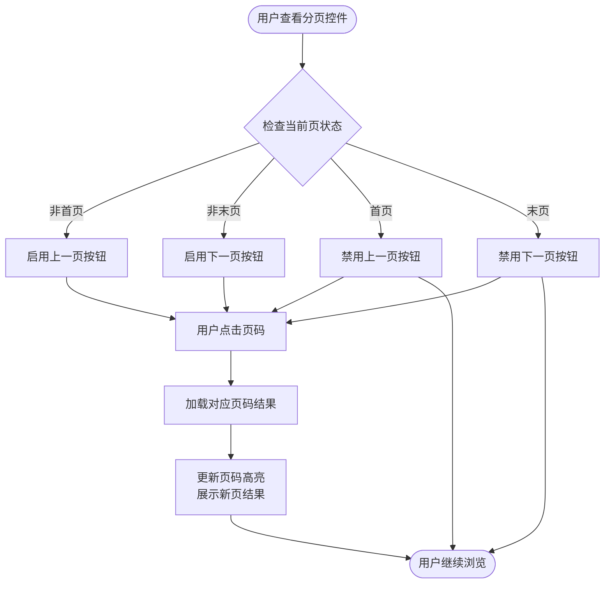
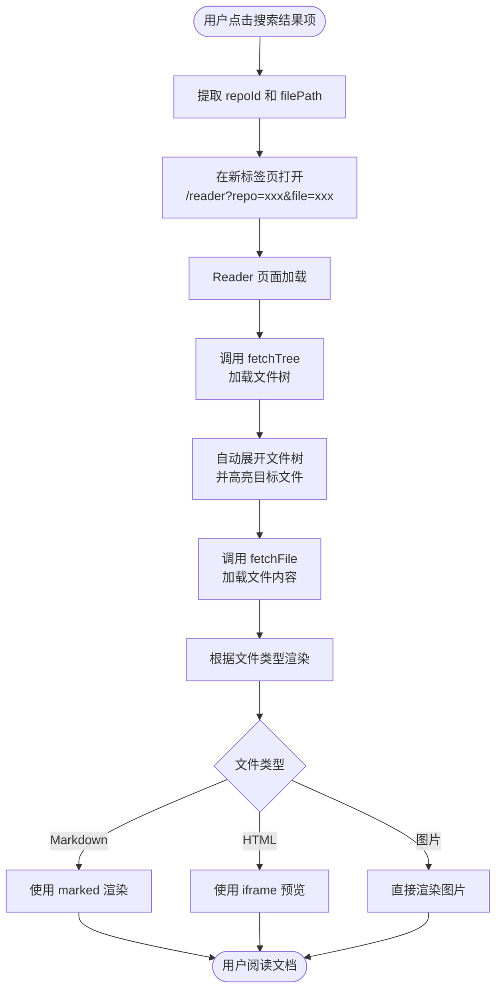
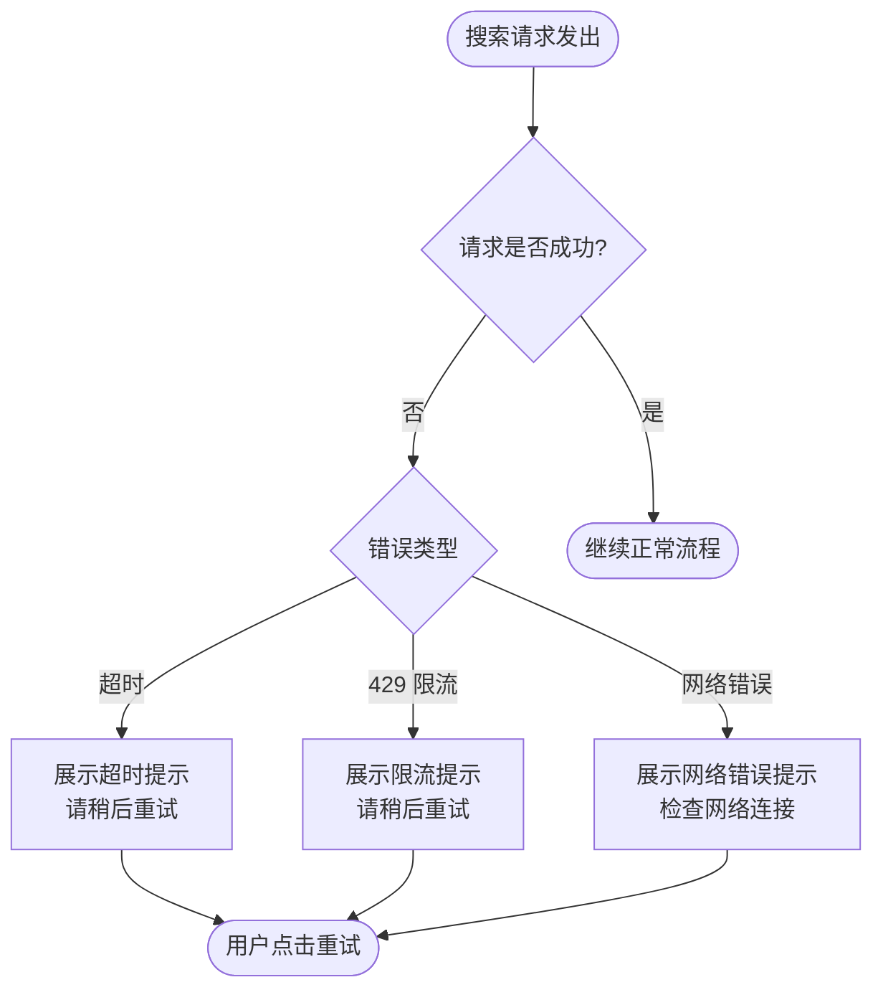
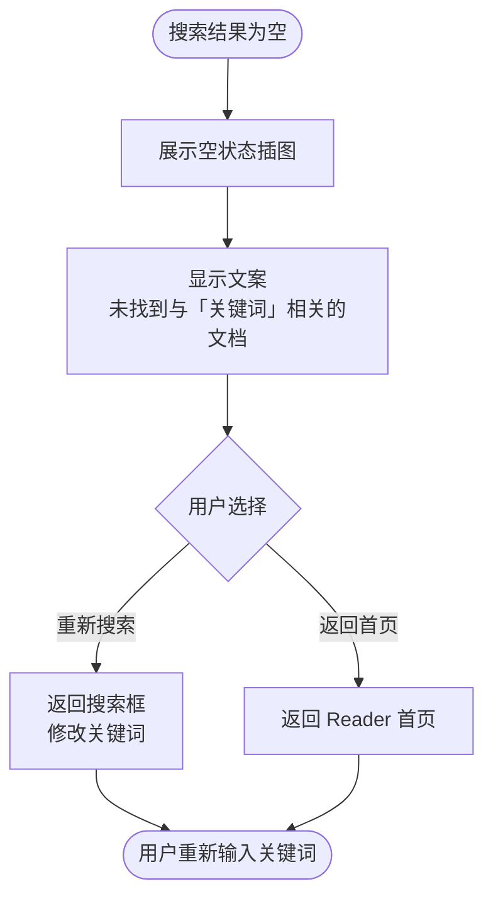

# 业务流程图 (Business Flow) - F2 文档查询功能

## 1. 业务流程概述

本文档描述文档查询功能的完整业务流程，包括用户交互、前后端协作和数据流转。

---

## 2. 核心业务流程

### 2.1 搜索主流程

```mermaid
flowchart TD
    Start([用户进入 Reader 页面])
    Start --> InputSearch[用户输入搜索关键词]
    InputSearch --> ClickSearch[用户点击搜索按钮]
    ClickSearch --> Navigate[/search?q=关键词]
    Navigate --> ShowLoading[展示搜索结果页面 / 显示加载状态]
    ShowLoading --> CallAPI{调用 GET /api/gitlab/search}
    CallAPI --> BackendProcess[后端处理请求]
    BackendProcess --> GitLabAPI[调用 GitLab Search API]
    GitLabAPI --> ReceiveRaw[接收 GitLab 返回结果]
    ReceiveRaw --> FilterRepos{过滤非白名单仓库}
    FilterRepos --> ReturnResults[返回过滤后的结果集]
    ReturnResults --> ShowResults[展示搜索结果列表]
    ShowResults --> DisplayCount[显示共 X 个结果]
    DisplayCount --> End([用户浏览结果])
```

### 2.2 搜索结果筛选流程



### 2.3 分页浏览流程



### 2.4 点击结果打开文档流程



---

## 3. 异常流程

### 3.1 搜索失败处理



### 3.2 空结果处理



---

## 4. 关键决策点汇总

| 决策点 | 条件 | 处理方式 |
| :--- | :--- | :--- |
| **搜索请求** | 关键词为空 | 提示"请输入搜索关键词" |
| **API 调用** | GitLab 返回 429 | 提示"搜索服务繁忙，请稍后重试" |
| **API 调用** | 网络超时 | 提示"搜索超时，请检查网络后重试" |
| **结果过滤** | 过滤后结果为空 | 展示空状态提示 |
| **分页切换** | 首页/末页 | 禁用对应方向的按钮 |
| **文件渲染** | 根据文件后缀 | MD 用 marked，HTML 用 iframe，图片直接渲染 |
