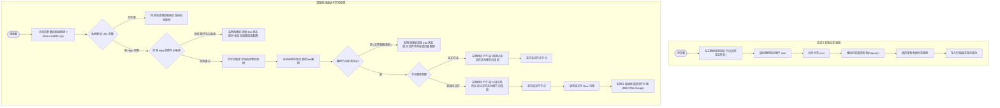

# 业务流程图 (Business Flow)

## 1. 业务流程说明
本次需求的核心业务流程分为两个部分：
1. **分享者**：在现有的左侧文件树节点上，通过交互操作获取“系统分享链接”。
2. **接收者**：通过点击分享链接进入系统，系统基于 URL 参数执行“下钻加载”或“文件渲染”，若遇异常则在组件内渲染 404 状态。

## 2. 流程图 (Mermaid)

```mermaid
flowchart TD
    %% 参与者与起点
    Sender([分享者])
    Receiver([接收者])
    
    %% 分享者流程
    subgraph ShareProcess [生成与复制分享链接]
        Sender --> FindNode["在左侧树找到目标节点(文件或文件夹)"]
        FindNode --> HoverNode["鼠标悬停显示操作 Icon"]
        HoverNode --> ClickIcon["点击分享 Icon"]
        ClickIcon --> ShowMenu["弹出分享选项菜单(Popover)"]
        ShowMenu --> SelectSysLink["选择复制'系统分享链接'"]
        SelectSysLink --> CopySuccess["写入剪贴板并提示成功"]
    end
    
    %% 接收者流程
    subgraph DirectAccessProcess [深度链接直达与异常处理]
        Receiver --> ClickLink["点击带参数的系统链接 ?repo=xxx&file=yyy"]
        ClickLink --> ParseURL{"系统解析 URL 参数"}
        
        %% 无参数分支
        ParseURL -->|无参数| LoadHome["按原有逻辑加载首页及所有仓库树"]
        
        %% 有参数分支
        ParseURL -->|有 repo 参数| CheckRepo{"校验 repo 权限与白名单"}
        
        %% 异常分支
        CheckRepo -->|无权限/不在白名单| Show404Repo["右侧阅读区渲染 404 状态 提示'仓库无权限或未配置'"]
        
        %% 正常流程
        CheckRepo -->|校验通过| FetchTree["异步拉取该仓库的完整目录树"]
        FetchTree --> ParseTree["在内存树中反向查找 file 路径"]
        ParseTree --> CheckFile{"路径节点是否存在?"}
        
        %% 文件不存在异常
        CheckFile -->|"否 (文件被删/改名)"| Show404File["右侧阅读区渲染 404 状态 提示'文件不存在或已被删除'"]
        
        %% 路径存在
        CheckFile -->|是| CheckNodeType{"节点类型判断"}
        
        %% 文件夹下钻
        CheckNodeType -->|是文件夹| DrillDownDir["左侧树执行'下钻' 直接以该文件夹为根节点渲染"]
        DrillDownDir --> HighLightDir["高亮该文件夹节点"]
        
        %% 文件下钻与渲染
        CheckNodeType -->|是具体文件| DrillDownFileDir["左侧树执行'下钻' 以该文件所在的父文件夹为根节点渲染"]
        DrillDownFileDir --> HighLightFile["高亮该文件节点"]
        HighLightFile --> FetchContent["请求该文件 Raw 内容"]
        FetchContent --> RenderContent["右侧主阅读区渲染文件内容 (MD/HTML/Image)"]
    end
```