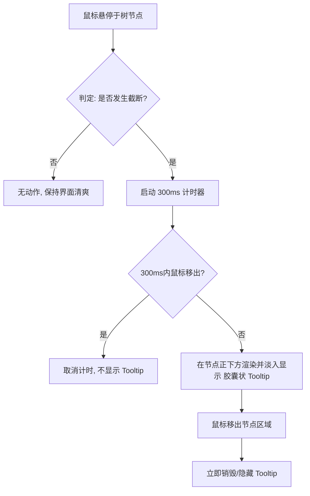

# 产品需求文档 (PRD) - 侧边栏视觉优化与交互增强

> **文档说明**：
> 本文档定义了 PRD-Reader `2604_2` 迭代中关于「侧边栏视觉优化」(`F2_SidebarVisualOptimization`) 的需求细节。涵盖了从底层系统约束到页面具体组件的交互逻辑。

***

## 1. 文档信息 (Document Information)

### 1.1 修订记录

| 版本号 | 变更日期 | 变更内容 | 变更人 |
| :--- | :--- | :--- | :--- |
| v1.0 | 2026-04-17 | 初始版本创建，完成基于 Soft & Pastel 风格的侧边栏截断、拖拽与智能 Tooltip 交互设计。 | AI PM |

### 1.2 关联文档链接
- [系统调研报告](./Background/System_Survey.md)
- [需求背景与目标](./Background/Requirement_Background.md)
- [概念设计推演](./Design/Concept_Design.md)
- [视觉趋势与风格指南](./Design/Design_Trend_Guide.md)
- [交互高保真原型 (HTML)](./Prototypes/index.html)

***

## 2. 背景 (Background)

### 2.1 项目概述与目标
在现有版本的 PRD-Reader 中，当文档文件名过长时，由于侧边栏宽度固定且未做合理的溢出处理，导致文本显示不全，严重影响了用户的阅读与查找效率。
**核心目标**：
1. 解决长文本显示不全的痛点，引入纯 CSS 的单行截断机制。
2. 增加基于“按需触发 (On-Demand)”的智能 Tooltip 提示，兼顾信息完整性与界面清爽度。
3. 赋予用户自定义侧边栏宽度的能力（拖拽功能），并确保视觉风格与系统现有的 Soft & Pastel 亲和马卡龙风格完全对齐。

### 2.2 用户画像 (User Personas)

| 角色名称 | 核心特征 | 核心痛点 | 核心诉求 |
| :--- | :--- | :--- | :--- |
| **文档阅读者 (Reader)** | 团队成员，需要频繁查阅 PRD 文档。 | 面对长文件名的需求文档，无法一眼看全标题，需要点击进去才能确认，效率低下。 | 偏好清晰直观的目录结构；希望能够根据自己的屏幕尺寸自由调整侧边栏宽度。 |
| **文档管理员 (Admin)** | 负责整理和规范 PRD 目录。 | 在编写和整理长标题的 PRD 时，发现系统侧边栏展示效果差，被迫缩减标题长度。 | 系统能够自适应各种长度的规范命名，不需要为了显示效果妥协命名规范。 |

### 2.3 用户故事 (User Stories)
**作为** 一名文档阅读者，
**我希望** 侧边栏过长的文件名能被优雅地用省略号截断，且在悬停时能看到完整的 Tooltip 提示，同时允许我拖拽调整侧边栏宽度，
**以便于** 我能够快速定位长标题文档，且不破坏整体柔和、整洁的阅读界面体验。
**验收标准**：
- 侧边栏支持最小 220px、最大 500px 的无级拖拽调整。
- 只有实际发生文本截断的节点，在悬停 300ms 后才会弹出包含完整文件名的胶囊状 Tooltip。

### 2.4 用户旅程 (User Journey)

| 阶段 | 1. 发现长文件 | 2. 探寻完整信息 | 3. 调整视图偏好 | 4. 沉浸阅读 |
| :--- | :--- | :--- | :--- | :--- |
| **用户行为** | 浏览侧边栏目录树，发现带有省略号的文件。 | 将鼠标悬停在截断文件上，查看弹出的完整文件名提示。 | 鼠标移动到侧边栏边缘，拖拽改变侧边栏宽度。 | 视线移回右侧主区域，主区域自适应伸缩继续阅读。 |
| **接触触点** | 侧边栏树节点 (Tree Node) | 智能 Tooltip (Smart Ink Tooltip) | 柔和拖拽手柄 (Soft Resizer) | 响应式主内容区 |

***

## 3. 名词字典与实体关系 (Data & ER Model)

*注：本需求主要为前端 UI/UX 纯展现层优化，不涉及后端数据库实体的增删改，因此此处仅定义前端视图层面的状态实体与业务名词。*

### 3.1 业务概念

| 业务名词 | 业务含义与约束 |
| :--- | :--- |
| **单行截断 (Text Truncation)** | 文本超出容器宽度时，不换行，隐藏超出部分并在尾部显示省略号 `...` 的 CSS 表现形式。 |
| **按需提示 (Smart Tooltip)** | 并非所有节点悬停都显示提示框。只有经过计算，确认文本发生了“单行截断”时，才允许触发提示框。 |
| **防抖延迟 (Debounce Delay)** | 为避免鼠标快速滑过侧边栏时触发大量闪烁的 Tooltip 轰炸，设定的 300 毫秒悬停等待时间。 |

### 3.2 视图状态实体 (View States)

#### 3.2.1 侧边栏视图状态

| 字段名称 | 字段类型 | 限制/默认值 | 必填 | 业务含义 |
| :--- | :--- | :--- | :--- | :--- |
| `当前宽度` | 数值 (px) | 默认 280，范围 [220, 500] | 是 | 侧边栏当前占据的像素宽度。 |
| `是否拖拽中` | 布尔值 | 默认 `false` | 是 | 标识用户当前是否正在按住手柄调整宽度。 |

#### 3.2.2 树节点状态

| 字段名称 | 字段类型 | 限制/默认值 | 必填 | 业务含义 |
| :--- | :--- | :--- | :--- | :--- |
| `节点文本` | 字符串 | 无 | 是 | 需要渲染的文件或文件夹名称。 |
| `是否发生截断` | 布尔值 | 动态计算 | 是 | 前端通过比较 `scrollWidth` 和 `clientWidth` 得出的结果。决定是否允许触发 Tooltip。 |
| `Hover状态` | 布尔值 | 默认 `false` | 是 | 鼠标是否当前悬停在该节点范围内。 |

***

## 4. 流程结构 (Flow Structure)

### 4.1 核心交互流程 (Hover 与截断判定)



### 4.2 宽度调整流程

```mermaid
flowchart TD
    A[鼠标在侧边栏右侧边缘按下] --> B[进入 '拖拽中' 状态, 光标变为 col-resize]
    B --> C[鼠标水平移动]
    C --> D[计算新宽度 = 鼠标 X 坐标 - 左侧偏移]
    D --> E{新宽度是否在 [220, 500] 范围内?}
    E -->|否| F[将宽度限制在临界值 220 或 500]
    E -->|是| G[应用新宽度至 CSS 变量]
    F --> H[主内容区 Flex 布局自动响应重排]
    G --> H
    H --> I[鼠标左键松开]
    I --> J[退出 '拖拽中' 状态]
```

***

## 5. 全局规则 (Global Rules)

### 5.1 视觉风格约束 (Soft & Pastel)
- **色彩与圆角**：必须严格继承系统既有 Blueprint 设计规范。主背景色 `#FDF4F5`，侧边栏 `#E8F3F1`，主文字色 `#4A4E69`。大圆角（`32px` 容器，`12px` 节点，`16px` Tooltip）不可妥协。
- **动效曲线**：所有 Hover、过渡、展开折叠动画必须使用 `cubic-bezier(0.4, 0, 0.2, 1)` 等带有一定弹性的平滑曲线，严禁使用生硬的线性 `linear` 过渡。

### 5.2 全局异常与容错策略
- **窗口极小化**：当浏览器窗口宽度被极度缩小（例如小于 600px）时，若此时侧边栏宽度为 500px，可能导致主阅读区被挤压至不可用。**容错处理**：主阅读区需设置 `min-width: 300px`，当侧边栏宽度 + 主阅读区最小宽度 > 窗口宽度时，优先保证主阅读区宽度，强行收缩侧边栏。

***

## 6. 功能模块与页面细节 (Functional Specs)

### 6.1 Reader 页面左侧模块 (`Reader.tsx` - Sidebar)

#### 6.1.1 模块整体说明

- **模块概述**：用于展示项目文件树的容器，是用户进行文档导航的核心区域。
- **结构与状态矩阵**：

| 模块状态 | 包含区域/交互元素 | 状态触发条件 |
| :--- | :--- | :--- |
| **常规静止态** | 侧边栏容器、目录树列表、隐藏的拖拽手柄 | 页面加载完毕，无鼠标交互。 |
| **拖拽调整态** | 侧边栏容器 (宽度实时变化)、高亮的柔和拖拽手柄 | 用户鼠标按住右侧边缘并移动。此时必须屏蔽内部所有节点的 Hover 响应和 Tooltip。 |
| **节点 Hover 态** | 目录树列表 (特定节点高亮)、胶囊 Tooltip (按需出现) | 鼠标在特定树节点上停留。 |

***

#### 6.1.2 侧边栏容器与柔和拖拽手柄 (Soft Resizer)

- **区域介绍与规则**：侧边栏整体容器及右侧用于调整宽度的边缘热区。
- **展示元素定义**：

| 元素名称 | 逻辑 (数据来源/计算逻辑) | 限制与格式 |
| :--- | :--- | :--- |
| 侧边栏容器 | CSS 变量 `--sidebar-width` | 带有 `32px` 圆角，背景色为 `--sidebar-bg`。带有柔和的蓝色阴影 `box-shadow`。 |
| 拖拽手柄热区 | 位于侧边栏右边缘，绝对定位。 | 宽度 `16px` (扩展热区方便点击)，不可见。鼠标移入时显示 `col-resize` 光标。 |
| 拖拽手柄视觉线 | 伪元素，基于热区状态渲染。 | 默认无色透明；Hover 或 Dragging 时显示为 4px 宽、大圆角的半透明蓝色光晕 (`--accent-blue`)，并伴有放大动效。 |

- **区域交互**：
  - **触发动作**：在拖拽手柄上按下鼠标左键并移动。
  - **结果呈现**：实时修改 `--sidebar-width` 变量。当达到最小边界 (220px) 或最大边界 (500px) 时，宽度停止变化，即使鼠标继续移动。拖拽过程中若存在任何 Tooltip，必须立即强制隐藏。

***

#### 6.1.3 目录树列表与节点 (Tree Node)

- **区域介绍与规则**：展示文件和文件夹层级的列表区。排版要求紧凑且圆润。
- **展示元素定义**：

| 元素名称 | 逻辑 (数据来源/计算逻辑) | 限制与格式 |
| :--- | :--- | :--- |
| 节点容器 | 绑定点击事件，支持 Active 状态。 | `12px` 圆角，`14px` 字体。Hover 时有 2px 的向右轻微位移动画。 |
| 节点文本 (`.label`) | 文件真实名称。 | **必须设置** `flex: 1`, `min-width: 0`, `white-space: nowrap`, `overflow: hidden`, `text-overflow: ellipsis`。 |
| 节点图标 | 根据文件类型/状态展示 Phosphor 图标。 | 固定大小，不能被 Flex 布局压缩 (`flex-shrink: 0`)。 |

- **区域交互**：
  - **结果呈现**：文本长度超过剩余空间时，尾部被 `...` 优雅截断，不会撑出横向滚动条或破坏父容器布局。

***

#### 6.1.4 【组件】智能胶囊提示 (Smart Pill-shape Tooltip)

- **组件整体说明**：这是一个挂载在 `body` 级别、脱离常规文档流的绝对定位悬浮组件。
- **展示元素定义**：

| 元素名称 | 逻辑 (数据来源/计算逻辑) | 限制与格式 |
| :--- | :--- | :--- |
| 提示框容器 | 固定最大宽度（如 320px），允许文本自然换行。 | 纯白背景，`16px` 大圆角胶囊形态。文字为深灰蓝色 (`--text-dark`)。带有精致的蓝色系软阴影和 1px 的高光边框。 |
| 提示文本 | 被 Hover 节点的完整 `.textContent`。 | 字体 `13px`，字重 600，行高 1.4。 |

- **组件交互与定位**：
  - **触发条件判定**：JS 获取当前 Hover 节点内 `.label` 元素的 `scrollWidth` 和 `clientWidth`。当且仅当 `scrollWidth > clientWidth` 时，允许启动渲染流程。
  - **防抖控制**：触发后，启动 `setTimeout(..., 300)`。若在 300ms 内鼠标 `mouseleave`，则 `clearTimeout` 取消渲染。
  - **位置计算**：获取目标节点的 `getBoundingClientRect()`。Tooltip 的 `top` 值设为节点底部边缘再往下偏移 6px (`rect.bottom + 6`)；`left` 值设为节点左侧边缘往右偏移 24px (`rect.left + 24`)，形成一种从节点下方斜斜弹出的视觉错落感。
  - **动画表现**：从下往上浮现 (`translateY(8px)` -> `0`) 配合缩放 (`scale(0.95)` -> `1`)，使用 `cubic-bezier(0.34, 1.56, 0.64, 1)` 产生带有轻微回弹的可爱动效。