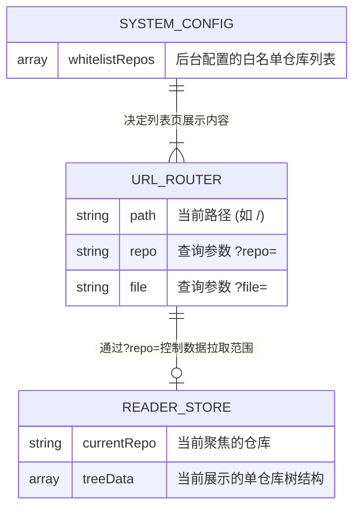

# 产品需求文档 (PRD)

## 1. 文档概述 (Document Overview)

### 1.1 文档信息
* **需求名称**：仓库切换与独立列表页
* **所属迭代**：2604_2
* **文档状态**：起草中
* **目标读者**：前端开发、测试工程师、UI 设计师

### 1.2 修订历史
| 版本 | 日期 | 修改内容 | 作者 |
| :--- | :--- | :--- | :--- |
| V1.0 | 2026-04-16 | 初始版本，定义独立列表页与阅读器内快捷切换逻辑。 | PM |

## 2. 需求背景与目标 (Background & Objectives)

### 2.1 当前痛点
在当前的 PRD-Reader 系统中，多个代码/文档仓库的文件树会被堆积在一起显示。当配置的仓库数量增多时，左侧文件树会显得过于拥挤和混乱，导致产品经理或开发者在寻找特定项目的文件时，需要耗费大量时间进行滚动和辨识。跨项目查阅体验不连贯。

### 2.2 业务目标
1. **降低认知负荷**：通过将仓库选择从具体文件阅读中剥离出来，提供一个清晰的“独立仓库列表页”，让用户在进入具体文档前能够快速定位目标项目。
2. **提升跨项目查阅效率**：在阅读器内（Reader）的左上角增加仓库切换的快捷入口，支持在不丢失阅读沉浸感的前提下，通过下拉列表快速切换仓库或返回仓库列表页。

## 3. 名词字典 (Glossary)

| 名词 (Term) | 定义说明 (Definition) | 备注 (Notes) |
| :--- | :--- | :--- |
| **独立仓库列表页** | 系统的默认首页（根路由 `/`），以网格卡片的形式展示当前系统配置的所有白名单仓库。 | 替代了原先直接展示混合文件树的逻辑。 |
| **阅读器 (Reader)** | 核心工作区，仅当 URL 中携带明确的 `?repo=` 参数时才渲染，并且强制只展示该指定仓库的文件树。 | 保证阅读的沉浸感与隔离性。 |
| **白名单仓库** | 由系统管理员在后台配置的允许公开访问的 GitHub/GitLab 仓库列表。 | 本次需求的唯一数据来源。 |

## 4. 核心业务流程 (Business Flow)
请参考配套的业务流程图：[Business_Flow.md](./Flow/Business_Flow.md)。
核心流转逻辑如下：
1. **路由分发**：系统首先根据 URL 判断是否携带 `?repo=` 参数。
2. **列表页展示**：若无参数，则渲染独立列表页。读取白名单配置，若为空则显示提示；若有数据，则渲染卡片网格。用户点击卡片跳转至阅读器。
3. **阅读器切换**：在阅读器内，用户点击侧边栏左上角仓库名称呼出下拉菜单。选择其他仓库将更新 URL 参数并重新拉取数据，同时默认加载 `README.md`；选择“返回”则清空参数跳回列表页。

## 5. 数据流与状态流转 (Data & State Flow)

### 5.1 实体关系说明 (ER Diagram)
本次需求不涉及新增后端实体，主要涉及前端路由状态与系统配置的映射关系。

### 5.2 状态机约束
1. **单一数据源约束**：仓库列表数据必须**仅**来源于现有的 `configStore` 中的白名单配置，绝不允许前端私自调用 API 获取用户的全量仓库。
2. **参数重置机制**：当通过卡片或下拉菜单切换仓库时，必须在更新 `?repo=` 参数的同时，强制清空 `?file=` 参数，以避免尝试在新仓库中加载旧仓库的文件。
3. **向后兼容重定向**：若用户访问旧的分享链接（仅有 `?file=` 无 `?repo=`），系统需直接重定向至根路由 `/` 的仓库列表页。

## 6. 功能模块与页面细节 (Features & UI Details)

### 6.1 独立仓库列表页 (Home View)
- **区域介绍与规则**：作为系统的默认入口（根路由），负责引导用户选择目标工作区。
- **展示元素定义**：

| 元素名称 | 逻辑 (数据来源/计算逻辑) | 限制与格式 |
| :--- | :--- | :--- |
| 右上角设置入口 | 静态路由链接 | 提供进入 `/admin` 的快捷入口（Gear 图标）。 |
| 头部信息区 | 静态展示 | 包含 PRD-Reader 的系统 Logo 或系统名称，以及提示文案。 |
| 仓库卡片网格 | `遍历 configStore.whitelistRepos` | 采用响应式 CSS Grid 布局，桌面端展示 3-5 列。 |
| 仓库卡片 (Item) | `单个白名单仓库对象` | 必须包含首字母彩色占位图。展示仓库名称 `name`、路径 `path` 和默认分支 `default_branch`。 |
| 空状态提示 | `当 whitelistRepos 为空时显示` | 友好的插画/图标及引导配置的文案。 |

- **交互逻辑**：点击任意仓库卡片，触发路由跳转，URL 附加 `?repo=[选中的仓库标识 id/name]`，并渲染 Reader 页面。系统默认寻找并打开该仓库根目录下的 `README.md` 文件。

### 6.2 阅读器：仓库切换触发器区 (Sidebar Top Area)
- **区域介绍与规则**：集成在左侧侧边栏 (Sidebar) 的最顶部，取代原有的静态系统名称，提供明确的当前上下文指示及下拉交互入口。
- **展示元素定义**：

| 元素名称 | 逻辑 (数据来源/计算逻辑) | 限制与格式 |
| :--- | :--- | :--- |
| 当前仓库名称 | `从 URL 的 ?repo= 参数中获取` | 包含仓库 Icon (☁️)，字体需醒目（如加粗），字号适中。 |
| 下拉指示箭头 | 静态展示 | 位于仓库名称右侧的向下小箭头（Chevron Down）。 |

- **交互逻辑**：鼠标 Hover 时可有微弱高亮反馈，点击该区域弹出“仓库下拉菜单”。

### 6.3 阅读器：仓库下拉菜单 (Dropdown Menu)
- **区域介绍与规则**：悬浮于页面之上的轻量级菜单，提供快捷切换能力。
- **展示元素定义**：

| 元素名称 | 逻辑 (数据来源/计算逻辑) | 限制与格式 |
| :--- | :--- | :--- |
| 浮层容器 | `点击触发器后显示` | 带有阴影和圆角的绝对定位容器。 |
| 仓库列表项 | `遍历 configStore.whitelistRepos` | 包含仓库显示名称 `name` 及其路径 `path`。 |
| 选中态标识 | `若列表项 == 当前 URL 的 repo，则显示` | 在当前阅读的仓库项旁边显示对勾（Check）图标，文字高亮。 |
| 分割线 | 静态展示 | 位于仓库列表与底部操作区之间。 |
| 返回列表页按钮 | 静态展示 | 位于分割线下方，文案如“← 返回所有项目”。 |

- **交互逻辑**：
  - 点击“非当前”的仓库列表项：关闭下拉菜单 -> 更新 URL `?repo=` 并清空 `?file=` -> 触发 ReaderStore 重新拉取对应仓库的文件树 -> 展示 Loading 状态 -> 默认渲染根目录下的 `README.md` 文件。
  - 点击“返回列表页按钮”：关闭下拉菜单 -> 清空 URL 中所有查询参数 -> 路由跳转回首页（独立列表页）。

### 6.4 阅读器：单仓库视图限制
- **区域介绍与规则**：底层数据加载逻辑的调整，对用户透明但至关重要。
- **逻辑规则**：Reader 组件在挂载（Mount）或 `?repo=` 参数变化时，触发的 `fetchTree` 动作必须被严格限制为**仅拉取当前 `repo` 对应的数据**。左侧文件树中不再出现多个顶层仓库节点，根节点直接为该单一仓库的文件和文件夹。

## 7. 非功能性需求 (NFR)
1. **响应式设计**：独立仓库列表页的网格布局必须完美适配桌面端和移动端，确保卡片宽度在不同分辨率下合理换行。
2. **性能优化**：仓库切换时，应利用 React 的机制实现局部重渲染，避免导致整个应用级别的硬刷新（Hard Reload），保持 SPA 的流畅体验。

## 8. 附录与相关链接
* [需求背景](./Background/Requirement_Background.md)
* [用户故事](./Background/User_Stories.md)
* [业务流程图](./Flow/Business_Flow.md)
* [页面结构设计](./Page_Structure.md)
